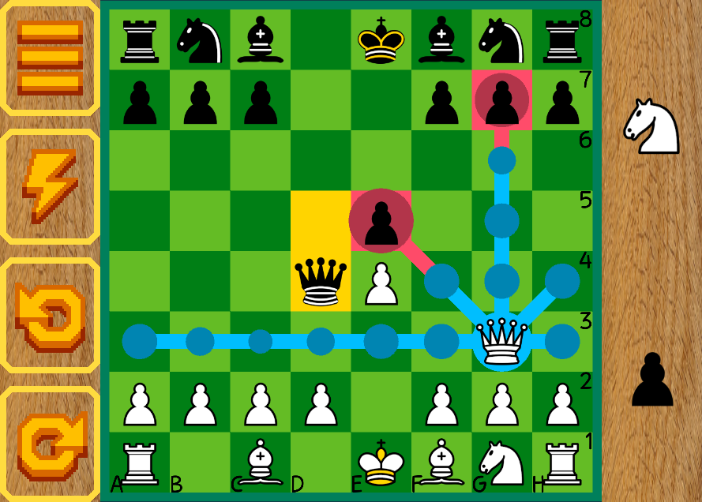
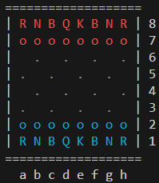
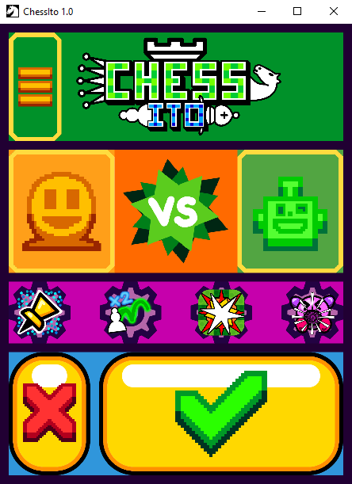

# Compilation

Pour lancer le jeu en graphique :
```shell
cargo run --package=board_graphic --release
```

Version console :

```shell
cargo run --package=board_console --release
```

# Screen 




# Other

I made all the of programming part by myself (engine, ui) as well as the game design (extra gamemode/relic) in 2 months.

This game was made for my intership last year 2024 at [Caramel Publishing](https://caramel.be/).
The game can be played on [itch io : ChessIto](https://mewily.itch.io/chessito).

When I created this game I had about 4 months of experience in Rust, some parts of the code can be improved (generic vector size, the game loop), but overall I am happy with it.

The credits for the assets can be found inside the game.
A portion of the credit is avaliable in [credit.txt](board_graphic/credit.txt)